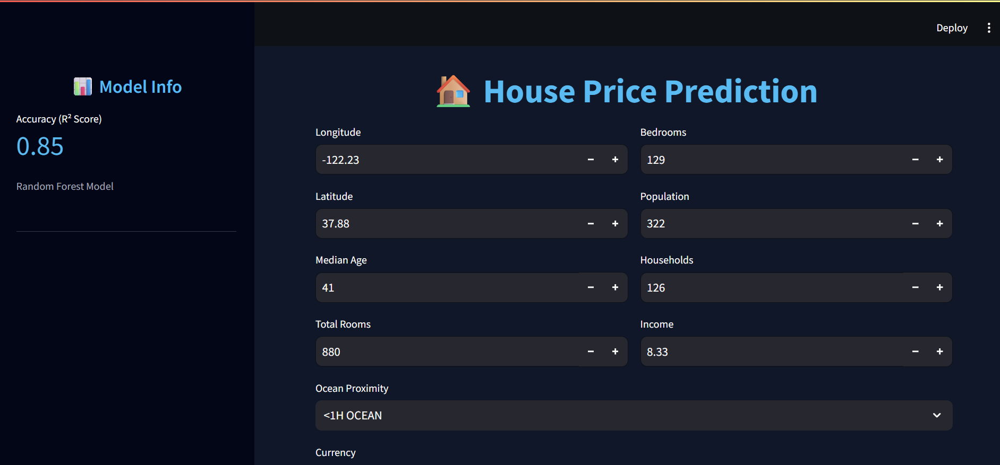

# California Housing Price Prediction

## Overview

This project implements a machine learning pipeline for predicting median house values in California using the classic [California Housing dataset](https://www.kaggle.com/datasets/camnugent/california-housing-prices). It uses scikit-learn for data preprocessing, model training (Random Forest Regressor), model persistence, batch inference, and a Streamlit web app for interactive predictions.

**Key Features:**

- Stratified train-test split based on median income categories
- Preprocessing pipeline: median imputation + scaling for numerical features, one-hot encoding for `ocean_proximity`
- Trained Random Forest model (best performer per exploration)
- Batch inference on test set
- Interactive Streamlit app supporting USD/INR predictions

## Dataset

- **Source**: housing.csv (20,640 districts)
- **Features** (9):
  | Feature | Description |
  |----------------------|------------------------------|
  | longitude | Longitude |
  | latitude | Latitude |
  | housing_median_age | Median house age (years) |
  | total_rooms | Total # rooms |
  | total_bedrooms | Total # bedrooms |
  | population | Block population |
  | households | Block households |
  | median_income | Median income (scaled $10k) |
  | ocean_proximity | Categorical (NEAR BAY, etc.) |
- **Target**: `median_house_value` (in $)

Test set saved as `input.csv` (~4,128 samples).

## Model Performance (10-fold CV RMSE)

| Model             | RMSE        |
| ----------------- | ----------- |
| Linear Regression | ~69,696     |
| Decision Tree     | ~71,066     |
| **Random Forest** | **~19,126** |

## Setup

1. **Python Environment**:
   ```bash
   python -m venv venv
   venv\\Scripts\\activate  # Windows
   pip install -r requirements.txt
   ```
2. **Dependencies** (`requirements.txt` created below):
   ```
   scikit-learn
   pandas
   numpy
   joblib
   streamlit
   ```

## Training New Model

```bash
python main.py
```

- Trains/saves `model.pkl` and `pipeline.pkl` if missing.

## Inference (Batch)

```bash
python main.py
```

- Loads model/pipeline, predicts on `input.csv` → `output.csv`.

## Interactive Prediction App

```bash
streamlit run app.py
```

- **Model metrics sidebar** (CV RMSE: $19,126, R²: 0.85)
- **Indian number formatting** for ₹ predictions (1 23,45,678)
- Enter house features
- Select currency (USD/₹)
- Get predicted median house value



## Files

| File         | Purpose                        |
| ------------ | ------------------------------ |
| housing.csv  | Full dataset                   |
| main_old.py  | Exploration & model comparison |
| main.py      | Train/save or infer            |
| app.py       | Streamlit prediction app       |
| input.csv    | Test set (20% stratified)      |
| output.csv   | Predictions on test set        |
| model.pkl    | Trained RandomForestRegressor  |
| pipeline.pkl | Preprocessing pipeline         |

## Results

- Predictions saved in `output.csv`
- Model ready for deployment via Streamlit app

## Next Steps

- Hyperparameter tuning (GridSearchCV)
- Cross-validation scoring
- Feature engineering (e.g., rooms per household)
- Deployment (Streamlit Cloud/Hugging Face Spaces)

## License

MIT
=======
# House_Price_prediction
>>>>>>> b4152615ecd0b7df22f404e6e90511850eeb24eb
